<div align="center">

# 🛡️ EigenCV: Zero-Trust Agentic Resume Pipeline

[](https://opensource.org/licenses/MIT)
[](#)
[](#)

**Stop letting ChatGPT hallucinate skills you don't have.** <br>
*A production-grade Infrastructure-as-Code (IaC) pipeline for generating ATS-perfect, highly tailored LaTeX resumes without sacrificing your integrity.*

</div>

---

## 🤯 Commercial AI Builders vs. EigenCV

**The Industry Standard (Commercial AI Builders):**  
You tell an AI to "optimize my resume for this job." The AI treats your resume as a creative writing exercise. It quietly hallucinates skills, inflates job titles, and paraphrases your engineering achievements into generic HR buzzwords. The result is a PDF that beats the ATS but fails the technical interview because it's full of lies.

**The EigenCV Approach (Zero-Trust):**  
We treat your career history as an immutable database. The AI is strictly an **orchestration layer**. It does not write your resume; it *queries* your database to pull the most relevant, pre-verified bullet points. 

If the AI attempts to go rogue and hallucinate a missing skill into your profile to artificially boost your ATS score, the Python compiler's **Lie Detector** intercepts it and hard-crashes the build. **Lies never make it into the PDF.**

---

## 🖼️ Example Output & Gallery

> **[PLACEHOLDER: Insert image of the final compiled PDF here]**
> *EigenCV automatically renders your JSON data into gorgeous, pixel-perfect LaTeX. Switch between layouts (like `Awesome-CV` or `EigenCV-Modern`), change corporate accent colors, and reorder sections using simple metadata toggles.*

---
## 🚀 The "Lie Detector" in Action

```text
+----------------------------- EigenCV Compiler ------------------------------+
| Compiling CV from build_config.json...                                      |
+-----------------------------------------------------------------------------+
Using layout template: eigencv_resume.tex.j2, Locale: en
+--------------------------- Zero-Trust Violation ----------------------------+
| Zero-Trust Violation: You declared 'Rust' as a missing skill, but it was    |
| hallucinated into the CV output!                                            |
| You cannot artificially inject skills you do not have into free-text fields.|
+-----------------------------------------------------------------------------+
ValueError: Hallucinated skill detected: Rust
```
*The user removes the hallucinated skill and recompiles:*
```text
+----------------------------- EigenCV Compiler ------------------------------+
| Compiling CV from build_config.json...                                      |
+-----------------------------------------------------------------------------+
Successfully compiled CV to CV-Applicant-Google.tex
Auto-compiling PDFs with pdflatex...
Successfully compiled CV-Applicant-Google.pdf

                       ATS Match Score: 85.0%                        
+-------------------------------------------------------------------+
| Category        | Skills                                          |
|-----------------+-------------------------------------------------|
| Missing (1)     | Rust                                            |
+-------------------------------------------------------------------+
[!] ATS Penalty Applied: 1 critical gap identified.
```

---

## ✨ Core USPs

* 🛡️ **Zero-Trust & The Lie Detector:** Your career history lives in a static JSON database. If the LLM attempts to hallucinate a skill you don't have into your resume to artificially boost your ATS score, the compiler's **Lie Detector** catches it and hard-crashes the build.
* 📄 **Automated LaTeX Compilation:** No more broken LaTeX parsing or missing brackets. The AI generates a strictly typed Pydantic JSON schema, which is then deterministically compiled into beautiful Jinja2 LaTeX templates.
* 🌍 **Multi-Language Support (Locale Fallback):** Applying abroad? The system supports native multi-language CVs. If you try to mix a Spanish Job Description with an English database, the compiler throws a `Language Mismatch Error` to prevent bilingual Frankenstein-CVs.
* 🧮 **Brutal Honesty ATS Scoring:** The post-compilation parser reads your generated PDF, checks for keyword frequency against the Job Description, and calculates a hard, mathematically honest ATS score. Missing "C#"? You get penalized. 
* 🔒 **100% Local & Privacy-First:** Your career data never leaves your machine unless you explicitly send it to an LLM via your trusted API or Agent. No shady web services, no tracking, no data harvesting.

---

## 🔬 Under the Hood: How it actually works

To appeal to the technical crowd, here is exactly how EigenCV pulls this off without over-engineering:

### 1. "Pseudo-RAG" (Context Window Routing)
We do **not** use Vector Databases (Chroma, Pinecone) or traditional RAG embeddings. Why? Because an individual's entire career history (even a 20-year veteran's) is only a few kilobytes of text. It easily fits into a modern LLM's context window. 
Instead of vector search, we use **In-Context Semantic Routing**. We feed your entire JSON database to the LLM and prompt it to output an array of `bullet_ids` that semantically match the Job Description. The LLM acts as the retriever, but the actual text insertion is handled deterministically by Python.

### 2. How the "Lie Detector" Catches Hallucinations
When the LLM analyzes the Job Description, it is forced to populate a `missing_skills` array in the JSON schema for any required skills you *do not* possess. *(Why do we track this? So you explicitly know your weak points, can strategically address them in your Cover Letter, or know exactly what to study before the technical interview!)*

The Python compiler (`cv_compiler.py`) intercepts the generated text fields (like your Summary Profile and Keyword list) *before* rendering the LaTeX. It performs a case-insensitive substring intersection between your `missing_skills` list and the AI-generated free-text. 
If `len(intersection) > 0`, the compiler immediately throws a `ZeroTrustViolationError` and aborts. The AI cannot sneak missing skills into your profile to trick the ATS scanner.

---

## 🛠️ System Architecture

```mermaid
sequenceDiagram
    autonumber
    actor U as 👤 User
    participant LLM as 🧠 Agent (Cursor)
    participant DB as 🗄️ Database
    participant Py as 🐍 Python Tools

    rect rgb(40, 40, 60)
    Note over U,DB: Phase 0: Setup & Privacy
    U->>Py: Run scrub_data.py
    Py->>DB: Wipe private data
    U->>LLM: Upload old CV
    LLM->>DB: Build JSON Database
    end

    rect rgb(20, 40, 20)
    Note over U,Py: Phase 1: Routing
    U->>LLM: Provide Job Description
    LLM->>DB: Query database
    DB-->>LLM: Return valid IDs
    LLM->>LLM: Generate build_config.json
    end
    
    rect rgb(60, 40, 20)
    Note over LLM,Py: Phase 2: Compile
    LLM->>Py: Execute cv_compiler.py
    rect rgb(120, 20, 20)
    Note over Py,DB: 🛡️ The Lie Detector<br>Crash if AI hallucinated!
    end
    
    Py->>DB: Fetch verified text
    Py-->>LLM: Render PDF via Jinja2
    end
    
    rect rgb(40, 60, 40)
    Note over LLM,Py: Phase 3: Verification
    LLM->>Py: Execute check_ats_score.py
    Py->>Py: Parse compiled PDF
    Py-->>LLM: Return ATS Score
    LLM-->>U: Present Final PDF & Score!
    end
```



---

## 🚦 The 3-Step Workflow

### Prerequisites
* Python 3.10+
* LaTeX distribution (e.g., TeX Live, MiKTeX) installed and added to PATH
* `pip install -r requirements.txt`
*(💡 Don't want to install LaTeX? Use the included **DevContainer** in VS Code to run everything instantly in Docker!)*

### Step 1: Onboarding (Build your Zero-Trust Database)
Before you apply to jobs, you must establish your Source of Truth.
1. Open your Agentic IDE (Cursor, Windsurf) or a web LLM (Claude/ChatGPT).
2. Feed it the `docs/AI_ONBOARDING_PROMPT.md`.
3. Paste the raw text dump of your old CV or LinkedIn profile.
4. The AI will systematically extract your data and generate your immutable JSON/Markdown files in `cv/database/active/`.

### Step 2: Agentic Routing (Apply to a Job)
Once your database is built, applying to jobs takes seconds.
1. Paste the target Job Description into your AI chat.
2. Tell the Agent: *"I want to apply to this job. Read `AI_START_HERE.md` and generate my application package."*
3. The Agent will semantically match your database to the job and output a strict `build_config.json`.

### Step 3: Compilation & Verification
*(💡 Note: If you are using an Agentic IDE like Cursor or Windsurf, the Agent will execute these commands for you automatically! If you are using a Web LLM, run them manually:)*
1. Run `python ../../cv/scripts/cv_compiler.py build_config.json` inside your new application folder.
2. The Python compiler verifies the JSON, runs the Lie Detector, and deterministically injects your data into the LaTeX templates.
3. Check the terminal for your honest ATS Score and review your beautiful PDF!

---

## 📖 Advanced Documentation
Looking to customize the LaTeX templates, add your own personal dossier for cultural-fit Cover Letters, or understand the Pydantic schema? 

👉 **[Read the Full User Guide](USER_GUIDE.md)**

---

## ⚖️ The Philosophy: Resumes as Code

Most commercial AI resume builders optimize for feeling good, not for technical accuracy. By maintaining your resume as a database and treating the LLM solely as an orchestration layer, you maintain **100% control over your narrative** while automating the tedious process of LaTeX formatting and ATS tailoring.

**Your career is a database. Version control it.**
Stop maintaining 15 different Word documents. By keeping your career facts in JSON files, you can treat your resume like software. Fork this repo, make it private, and use Git to track your career progression (`git commit -m "Promoted to Senior"`). When you find a job you like, let the Agent query your database, compile your LaTeX, and land the job.

---

## 🙏 Acknowledgements

EigenCV's default LaTeX templates are heavily inspired by and utilize components from the excellent [Awesome-CV](https://github.com/posquit0/Awesome-CV) project created by Byungjin Park (posquit0). We are grateful for their beautiful typographic foundation!
