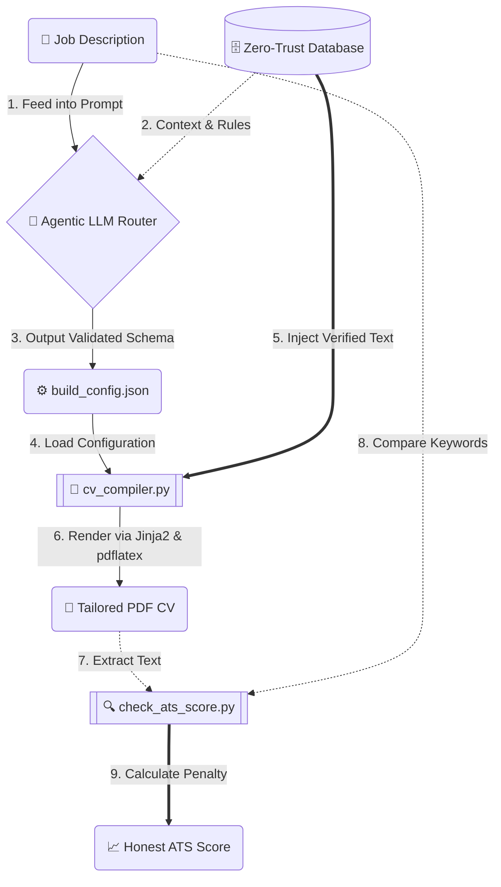

<div align="center">

# 🛡️ EigenCV: Zero-Trust Agentic Resume Pipeline

[](https://opensource.org/licenses/MIT)
[](#)
[](#)

**Stop letting ChatGPT hallucinate skills you don't have.** <br>
*A production-grade Infrastructure-as-Code (IaC) pipeline for generating ATS-perfect, highly tailored LaTeX resumes without sacrificing your integrity.*

</div>

---

## 🤯 The Problem with AI Resume Builders
If you tell ChatGPT to "tailor my resume for this job", it will quietly invent skills, inflate your job titles, and paraphrase your hard engineering achievements into generic HR buzzwords (like *"Spearheaded cross-functional synergies"*). 

**EigenCV solves this.** We treat your career history as an immutable database and the LLM solely as an orchestration layer. 

---

## 🚀 The "Lie Detector" in Action

> All modern LLMs (like ChatGPT or Claude) are mathematically prone to hallucinating skills when asked to "optimize for ATS". EigenCV acts as an impenetrable shield against this. If the AI goes rogue and attempts to sneak a fake skill into your resume config, the Python compiler catches it and hard-crashes:

```text
+----------------------------- EigenCV Compiler ------------------------------+
| Compiling CV from build_config.json...                                      |
+-----------------------------------------------------------------------------+
Using layout template: eigencv_resume.tex.j2, Locale: en
+--------------------------- Zero-Trust Violation ----------------------------+
| Zero-Trust Violation: You declared 'Rust' as a missing skill, but it was    |
| hallucinated into the CV output!                                            |
| You cannot artificially inject skills you do not have into free-text fields.|
+-----------------------------------------------------------------------------+
ValueError: Hallucinated skill detected: Rust
```
*The user removes the hallucinated skill and recompiles:*
```text
+----------------------------- EigenCV Compiler ------------------------------+
| Compiling CV from build_config.json...                                      |
+-----------------------------------------------------------------------------+
Successfully compiled CV to CV-Applicant-Google.tex
Auto-compiling PDFs with pdflatex...
Successfully compiled CV-Applicant-Google.pdf

                       ATS Match Score: 85.0%                        
+-------------------------------------------------------------------+
| Category        | Skills                                          |
|-----------------+-------------------------------------------------|
| Missing (1)     | Rust                                            |
+-------------------------------------------------------------------+
[!] ATS Penalty Applied: 1 critical gap identified.
```

---

## ✨ Core USPs

* 🛡️ **Zero-Trust & The Lie Detector:** Your career history lives in a static JSON database. If the LLM attempts to hallucinate a skill you don't have into your resume to artificially boost your ATS score, the compiler's **Lie Detector** catches it and hard-crashes the build.
* 📄 **Automated LaTeX Compilation:** No more broken LaTeX parsing or missing brackets. The AI generates a strictly typed Pydantic JSON schema, which is then deterministically compiled into beautiful Jinja2 LaTeX templates.
* 🌍 **Multi-Language Support (Locale Fallback):** Applying abroad? The system supports native multi-language CVs. If you try to mix a Spanish Job Description with an English database, the compiler throws a `Language Mismatch Error` to prevent bilingual Frankenstein-CVs.
* 🧮 **Brutal Honesty ATS Scoring:** The post-compilation parser reads your generated PDF, checks for keyword frequency against the Job Description, and calculates a hard, mathematically honest ATS score. Missing "C#"? You get penalized. 

---

## 🔬 Under the Hood: How it actually works

To appeal to the technical crowd, here is exactly how EigenCV pulls this off without over-engineering:

### 1. "Pseudo-RAG" (Context Window Routing)
We do **not** use Vector Databases (Chroma, Pinecone) or traditional RAG embeddings. Why? Because an individual's entire career history (even a 20-year veteran's) is only a few kilobytes of text. It easily fits into a modern LLM's context window. 
Instead of vector search, we use **In-Context Semantic Routing**. We feed your entire JSON database to the LLM and prompt it to output an array of `bullet_ids` that semantically match the Job Description. The LLM acts as the retriever, but the actual text insertion is handled deterministically by Python.

### 2. How the "Lie Detector" Catches Hallucinations
When the LLM analyzes the Job Description, it is forced to populate a `missing_skills` array in the JSON schema for any required skills you *do not* possess.
The Python compiler (`cv_compiler.py`) intercepts the generated text fields (like your Summary Profile and Keyword list) *before* rendering the LaTeX. It performs a case-insensitive substring intersection between your `missing_skills` list and the AI-generated free-text. 
If `len(intersection) > 0`, the compiler immediately throws a `ZeroTrustViolationError` and aborts. The AI cannot sneak missing skills into your profile to trick the ATS scanner.

---

## 🛠️ System Architecture



---

## ⚡ Quickstart

### Prerequisites
* Python 3.10+
* LaTeX distribution (e.g., TeX Live, MiKTeX) installed and added to PATH
* `pip install -r requirements.txt`

*(💡 Don't want to install LaTeX? Use the included **DevContainer** in VS Code to run everything instantly in Docker!)*

### The Agentic Workflow (Recommended)
This pipeline is designed to be operated by an Agentic Coding Assistant (like Cursor) or a Web LLM (Claude 3.5 Sonnet).

1. **Upload your old CV:** Use the `docs/AI_ONBOARDING_PROMPT.md` to have the AI extract your old CV into the immutable JSON database (`cv/database/active/`).
2. **Apply to a Job:** Open the repo in Cursor (or upload the ZIP to Claude). Paste the Job Description and say:
   > *"I want to apply to this job. Read `AI_START_HERE.md` and generate my application package."*
3. **Sit back:** The Agent will semantically match your database bullets to the job, structure the JSON, compile the LaTeX, and run the ATS check.

### Manual CLI Workflow
1. `python new_app.py "Google" "SoftwareEngineer"`
2. Paste the Job Description into the new folder.
3. Use ChatGPT to generate the `build_config.json`.
4. Run `python ../../cv/scripts/cv_compiler.py build_config.json` inside the folder.

---

## 📖 Advanced Documentation
Looking to customize the LaTeX templates, add your own personal dossier for cultural-fit Cover Letters, or understand the Pydantic schema? 

👉 **[Read the Full User Guide](USER_GUIDE.md)**

---

## ⚖️ The Philosophy: Resumes as Code

Most commercial AI resume builders optimize for feeling good, not for technical accuracy. By maintaining your resume as a database and treating the LLM solely as an orchestration layer, you maintain **100% control over your narrative** while automating the tedious process of LaTeX formatting and ATS tailoring.

**Your career is a database. Query it.**
