<div align="center">

# 🛡️ EigenCV: Zero-Trust Agentic Resume Pipeline

[](https://opensource.org/licenses/MIT)
[](#)
[](#)

**Stop letting ChatGPT hallucinate skills you don't have.** <br>
*An Infrastructure-as-Code (IaC) pipeline to generate ATS-optimized LaTeX resumes; Using your REAL data, keeping you in full control, and protecting your integrity.*

</div>

---

## 🤯 Commercial AI Builders vs. EigenCV

**The Industry Standard (Commercial AI Builders):**  
You tell an AI to "optimize my resume for this job." The AI treats your resume as a creative writing exercise. It quietly hallucinates skills, inflates job titles, and paraphrases your engineering achievements into generic HR buzzwords. The result is a PDF that beats the ATS but fails the technical interview because it's full of lies.

**The EigenCV Approach (Zero-Trust):**  
We treat your career history as an immutable database. The AI is strictly an **orchestration layer**. It does not write your resume; it *queries* your database to pull the most relevant, pre-verified bullet points. 

If the AI attempts to go rogue and hallucinate a missing skill into your profile to artificially boost your ATS score, the Python compiler's **Lie Detector** intercepts it and hard-crashes the build. **Obvious lies never make it into the PDF.**

---

## 🖼️ Example Output & Gallery

> 
> 

### 🎨 Total Customization & Control
The sample above is just one configuration. EigenCV puts you in complete control:
- **Dynamic Sections:** Not all sections are mandatory. Choose exactly what to include and reorder them instantly (e.g., move 'Education' to the top) by simply editing the comma-separated `cvorder` variable.
- **Change Layouts:** Seamlessly swap between professional LaTeX templates (e.g., `Awesome-CV`, `EigenCV-Modern`).
- **Brand Yourself:** Inject custom corporate accent colors to match the company you're applying to.- **Multilingual:** Generate applications in English, German, or any other language using the built-in translation matrix.

---

## 🚀 How to Use EigenCV: Choose Your Path

### Path 1: The "No-Code" Lifehack (Cloud AI)

> **AI Compatibility — Be honest with yourself:**
> | AI | Full Pipeline | Local / Private | Notes |
> |---|---|---|---|
> | **ChatGPT Plus** | ✅ | ❌ | Requires Advanced Data Analysis tier |
> | **Claude** | ⚠️ Partial | ❌ | claude.ai loads all ZIP files at once — hits token limits fast. Use **Claude Code** (Path 2) instead |
> | **Gemini** | ❌ | ❌ | No persistent file context across messages |

**Instructions for ChatGPT Plus (Recommended):**

1. **Get the ZIP file** — choose the right option for you:
   - **First time? (Blank Slate):** Click the green **"Code"** button on GitHub → **"Download ZIP"**. This gives you a clean copy with sample data.
   - **Already onboarded your data locally?** Run `python tools/export_for_cloud.py` from the repository root. This generates a clean `EigenCV_for_cloud.zip` with your real data but **without** the `.git` folder, keeping the upload lean and your context window clean.
2. **Build your Master Database:** Upload the ZIP to ChatGPT, along with ALL your old resumes. Tell the AI: *"Extract all my career facts from these resumes and populate the EigenCV JSON database."*
3. **Apply to a Job:** Paste the Job Description and tell the AI: *"Please apply to this job using the instructions found in `docs/AI_GENERATION_PROMPT.md`."*
4. **Download your PDF:** ChatGPT will match your database to the job, generate the strict JSON, and run the `chatgpt_run.py` wrapper to render the PDF directly in its sandbox.
*(Fallback: If ChatGPT times out, it will still generate the `.tex` code. Drag & drop that into a free **[Overleaf](https://overleaf.com)** account for instant rendering.)*

### Path 2: The Agentic Developer Route (CLI & IDE)
If you prefer terminal workflows, need maximum build speed, or require strict data privacy, run the pipeline locally.

> **Agentic Client Compatibility:**
> | Client | Full Pipeline | Local Model (Privacy) | Notes |
> |---|---|---|---|
> | **Antigravity** | ✅ | ✅ via Ollama | What this repo was built with |
> | **Claude Code** | ✅ | ❌ | Anthropic API only |
> | **Cursor** | ✅ | ✅ via Ollama | Composer agent mode |
> | **Windsurf** | ✅ | ✅ via Ollama | Cascade agent mode |
> | **Cline** (VS Code) | ✅ | ✅ via Ollama | Open-source, very capable |
> | **Aider** | ✅ | ✅ via Ollama | CLI-first, great for power users |
> | **GitHub Copilot** | ⚠️ Partial | ❌ | Agent mode limited, no shell access |

1. **Prerequisites:** You need Python 3.11+ and a LaTeX distribution (e.g., TeX Live or MiKTeX). *Alternatively, simply open this repo in VS Code and click "Reopen in Container" to use our pre-built Docker environment!*
2. **Install Dependencies:** Run `pip install -r requirements.txt`.
3. **Agent Setup:** 
   - **For Maximum Speed:** Open the repository using an Agentic CLI (like **Antigravity** / **Claude Code**) or an Agentic IDE (**Cursor** / **Windsurf**) connected to their standard cloud APIs.
   - **For 100 % Hardcore Privacy:** Point your Agentic IDE to a local model (like **Ollama** or **LM Studio**) so your data NEVER leaves your machine.
4. **Build the DB:** Tell the Agent: *"Migrate my old CV. Follow `AI_START_HERE.md`."* to build your Zero-Trust database.
5. **Apply:** Paste a Job Description and say: *"Apply to this job. Follow `AI_START_HERE.md`."*
6. **Automation:** The Agent will automatically route the prompts, generate the strict JSON, and execute the Python scripts locally to render your PDF and calculate your ATS score!


---

## ⚙️ Architecture & Workflow

Most AI tools use a "generate and pray" approach. EigenCV uses **Agentic Determinism**. Here is how we guarantee a flawless, hallucination-free application:

1. **The Immutable Master Database:** You don't paste your resume into a chat window. Your career history lives offline as a structured JSON/Markdown database on your hard drive. Every achievement, project, and skill has a mathematically verifiable ID (e.g., `proj_aws_migration`).
2. **AI Orchestration (The Brain):** When applying for a job, the AI reads the Job Description and acts as a strategic orchestrator. Instead of writing text, it executes a precise query against your database, returning only the IDs that maximize your ATS match score. It crafts a hyper-authentic Cover Letter based *exclusively* on your verified profile data.
3. **Deterministic Compilation (The Muscle):** The AI is entirely locked out of the rendering process. The EigenCV Python compiler takes the approved list of IDs, fetches the exact text from your offline database, and deterministically injects it into a stunning, ATS-optimized LaTeX template. **Flawless layouts, no hallucinations.**

```mermaid
sequenceDiagram
    autonumber
    actor U as 👤 User
    participant LLM as 🧠 Agent
    participant DB as 🗄️ Database
    participant Py as 🐍 Python Tools

    rect rgb(40, 40, 60)
    Note over U,DB: Phase 0: Setup & Privacy
    U->>Py: Run scrub_data.py
    Py->>DB: Wipe private data
    U->>LLM: Upload old CV
    LLM->>DB: Build JSON Database
    end

    rect rgb(20, 40, 20)
    Note over U,Py: Phase 1: Routing
    U->>LLM: Provide Job Description
    LLM->>DB: Query database
    DB-->>LLM: Return valid IDs
    LLM->>LLM: Generate build_config.json
    end
    
    rect rgb(60, 40, 20)
    Note over LLM,Py: Phase 2: Compile
    LLM->>Py: Execute cv_compiler.py
    Note over Py,DB: 🏥 Healer auto-corrects IDs<br>🛡️ Lie Detector prevents hallucinations
    Py->>DB: Fetch verified text
    Py-->>LLM: Render PDF via Jinja2
    end
    
    rect rgb(40, 60, 40)
    Note over LLM,Py: Phase 3: Verification
    LLM->>Py: Execute check_ats_score.py
    Py->>Py: Parse compiled PDF
    Py-->>LLM: Return ATS Score
    LLM-->>U: Present Final PDF & Score!
    end
```



---

## 🚀 The "Lie Detector" in Action

```text
+----------------------------- EigenCV Compiler ------------------------------+
| Compiling CV from build_config.json...                                      |
+-----------------------------------------------------------------------------+
Using layout template: eigencv_resume.tex.j2, Locale: en
+--------------------------- Zero-Trust Violation ----------------------------+
| Zero-Trust Violation: You declared 'Rust' as a missing skill, but it was    |
| hallucinated into the CV output!                                            |
| You cannot artificially inject skills you do not have into free-text fields.|
+-----------------------------------------------------------------------------+
ValueError: Hallucinated skill detected: Rust
```
*The user removes the hallucinated skill and recompiles:*
```text
+----------------------------- EigenCV Compiler ------------------------------+
| Compiling CV from build_config.json...                                      |
+-----------------------------------------------------------------------------+
Successfully compiled CV to CV-Applicant-Google.tex
Auto-compiling PDFs with pdflatex...
Successfully compiled CV-Applicant-Google.pdf

                       ATS Match Score: 85.0 %                        
+-------------------------------------------------------------------+
| Category        | Skills                                          |
|-----------------+-------------------------------------------------|
| Missing (1)     | Rust                                            |
+-------------------------------------------------------------------+
[!] ATS Penalty Applied: 1 critical gap identified.
```

---

## ✨ Core USPs

* 🛡️ **Zero-Trust & The EigenTruth Engine:** Your career history lives in a static JSON database. If the LLM attempts to hallucinate a skill you don't have into your profile to artificially boost your ATS score, the compiler's **EigenTruth Engine** (our Lie Detector) catches it and hard-crashes the build.
* 📊 **Data-First Approach:** We strictly decouple your career data from the presentation layer. Your resume is not a text document, it is a structured dataset. The AI acts exclusively as a search filter on this data, never as an author.
* 🔒 **Immutable Database:** Your bullet points and skills are strictly **IMMUTABLE**. You can maintain them yourself or use LLMs to prep them, but within the EigenCV pipeline, the AI is only allowed to *select* them, never rewrite them.
* ✍️ **Authentic Cover Letters:** The AI uses your `personal_dossier.md` to write hyper-authentic cover letters based *only* on your real soft skills and hobbies, eliminating corporate fluff.
* 🎨 **Corporate Auto-Coloring:** The AI automatically deduces the target company's corporate identity and dynamically injects matching accent colors into the LaTeX output (or you can override it manually).
* 🧮 **Advanced ATS Engine & Reality Checks:** The post-compilation Python parser calculates a mathematically honest ATS keyword match score. Meanwhile, the AI Agent acts as a ruthless filter, estimating interview/offer probabilities and salary ranges based *strictly* on your verified skills, creating a realistic Probability Matrix.
* 🏥 **Self-Healing IDs:** If the LLM makes a minor typo when selecting an ID from your database (e.g., `aws_mig` instead of `aws_migration`), the compiler's built-in `rapidfuzz` heuristics will auto-heal the ID, preventing brittle build crashes.
* 📄 **Automated LaTeX Compilation:** No more broken LaTeX parsing or missing brackets. The AI generates a strictly typed Pydantic JSON schema, deterministically compiled into beautiful Jinja2 LaTeX templates.
* 🌍 **Multi-Language Support & Auto-Translation (Beta):** Applying abroad? The system supports native multi-language CVs with strict language mismatch prevention, and features an experimental auto-translation engine to dynamically localize your database.
* 🏗️ **Dynamic Section Routing:** Don't have any open-source projects for a specific application? Simply omit the array in the JSON. The Jinja2 engine will dynamically hide the section and recalculate the LaTeX geometry without leaving awkward whitespace.
* 🐳 **Containerized Reproducibility:** Comes with a pre-configured VS Code DevContainer. Boot a fully sandboxed environment to get a full TeX Live distribution inside Docker. *(Note: The initial Docker build downloads the 4GB distribution, grab a coffee. After that, compile CVs locally without polluting your host machine.)*
* 🕵️ **100 % Local & Privacy-First (Optional):** Your career data never leaves your machine unless you explicitly send it to an LLM via your trusted API or Agent. No web services, no data harvesting.

---

## 🔬 Design Decisions (Under the Hood)

EigenCV prioritizes deterministic reliability over trendy AI complexity. For the engineers reading this, here is a transparent look at the core architectural decisions behind the pipeline:

### 1. "Pseudo-RAG" (Context Window Routing)
We do **not** use Vector Databases (Chroma, Pinecone) or traditional RAG embeddings. Why? Because an individual's entire career history (even a 20-year veteran's) is only a few kilobytes of text. It easily fits into a modern LLM's context window. 
Instead of vector search, we use **In-Context Semantic Routing**. We feed your entire JSON database to the LLM and prompt it to output an array of `bullet_ids` that semantically match the Job Description. The LLM acts as the retriever, but the actual text insertion is handled deterministically by Python.

### 2. The EigenTruth Engine (How We Catch Hallucinations)
**Is it really "Zero-Trust" if the AI generates the Cover Letter and Profile?** 
Yes, but it's a *Constrained Generation Boundary*. While your hard facts (experience bullets, projects) are 100 % immutable and fetched via IDs, your Profile and Cover Letter *must* be dynamically written to address the specific company's mission. 

To maintain Zero-Trust here, the Python compiler (`cv_compiler.py`) intercepts these generated text fields *before* rendering the LaTeX. When the LLM analyzes the Job Description, it is forced to populate a `missing_skills` array for any required skills you *do not* possess. 

The compiler performs a strict Regex negative lookahead/lookbehind intersection (`(?<!\w)`) between your `missing_skills` list and the AI-generated free-text. If a match is found, the compiler immediately throws an `EigenTruthViolationError` and aborts. The AI cannot sneak missing skills into your prose to trick the ATS scanner.

**Why a Regex engine and not a State-of-the-Art "LLM-as-a-Judge"?** 
Because *Pragmatism > Over-engineering*. Your CV compiler should run completely offline, deterministically, in <1 second, without requiring an active API key or costing $0.05 per build. Our EigenTruth Engine is O(1), free, and bulletproof for this specific use case.

### 3. RapidFuzz Healing (Fault Tolerance)
LLMs are notoriously bad at outputting exact string matches. If your database ID is `aws_migration_2023`, the LLM might output `aws_mig_23`. Traditional build systems would throw a `KeyError` and crash. 
EigenCV uses the `rapidfuzz` library (C++ optimized Levenshtein distance) to mathematically calculate the closest matching ID in your database. This provides graceful degradation: we tolerate minor AI typos while strictly maintaining data integrity.

### 4. Pydantic over Prompt Engineering
We do not rely on complex "Prompt Engineering" to format the CV. We force the LLM to output data strictly matching a `cv_schema.py` Pydantic model. If the LLM violates the schema (e.g., nesting arrays where strings should be), the pipeline rejects it before it ever reaches the LaTeX compiler. Strong typing beats prompt engineering.

### 5. LaTeX vs HTML-to-PDF (The ATS Text Layer)
Many modern CV builders use web technologies (React/HTML) and use Headless Chrome (Puppeteer) to print to PDF. **This is fatal for ATS.** Browser engines often render PDFs with fragmented, non-sequential text layers, causing ATS parsers to misread the document.
EigenCV uses `pdflatex`. LaTeX was built from the ground up for print typography. It guarantees a sequential, machine-readable text layer, ensuring the ATS parses your resume exactly from top to bottom.


## 📖 Advanced Documentation
Looking to customize the LaTeX templates, add your own personal dossier for cultural-fit Cover Letters, or understand the Pydantic schema? 

👉 **[Read the Full User Guide](USER_GUIDE.md)**

---

## ⚖️ The Philosophy: Resumes as Code

Most commercial AI resume builders optimize for feeling good, not for technical accuracy. By keeping your resume in a database and restricting the AI to basic data retrieval, you keep **100 % control over your facts**. You only automate the tedious parts: LaTeX formatting and ATS keyword matching.

**Your career is a database. Version control it.**
Stop maintaining 15 different Word documents. By keeping your career facts in JSON files, you can treat your resume like software. Fork this repo, make it private, and use Git to track your career progression (`git commit -m "Promoted to Senior"`). When you find a job you like, let the Agent query your database, compile your LaTeX, and land the job.

---

## 🙏 Acknowledgements

EigenCV's default LaTeX templates utilize a color palette inspired by the excellent [Awesome-CV](https://github.com/posquit0/Awesome-CV) project created by Byungjin Park (posquit0). We are grateful for their beautiful typographic colors! *(Note: The structural layout of EigenCV is entirely custom-built for Jinja2 deterministic rendering and was not derived from Awesome-CV's layout engine).*
